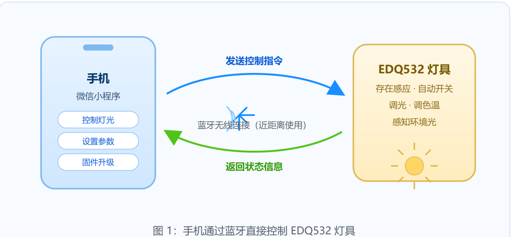
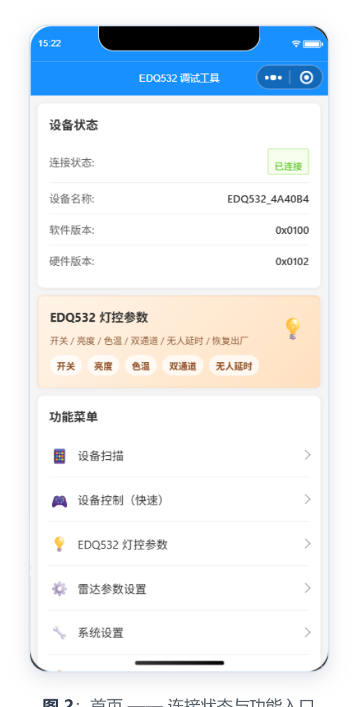
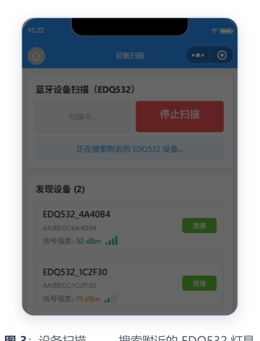
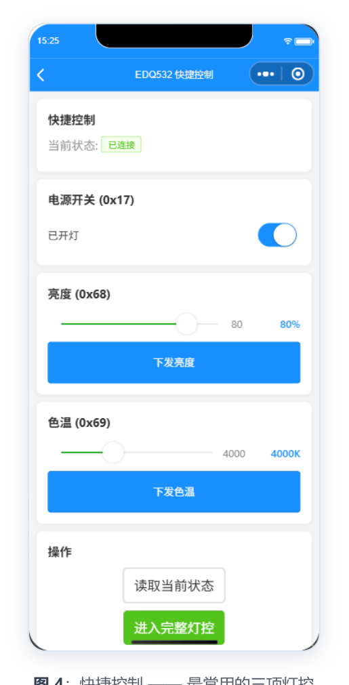
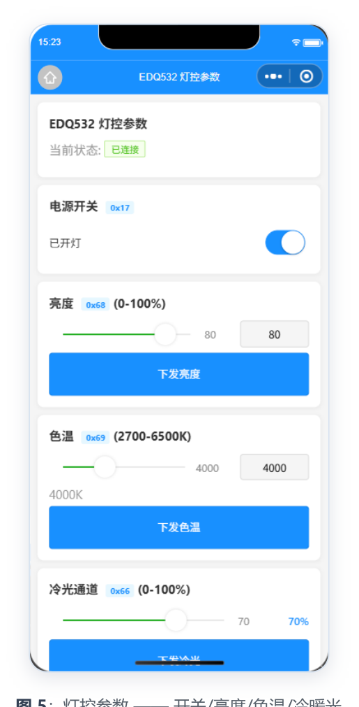
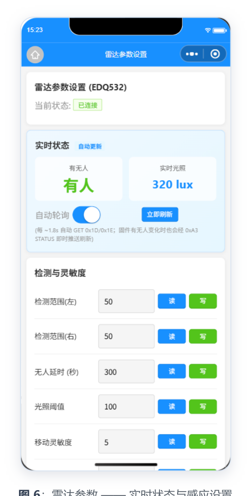
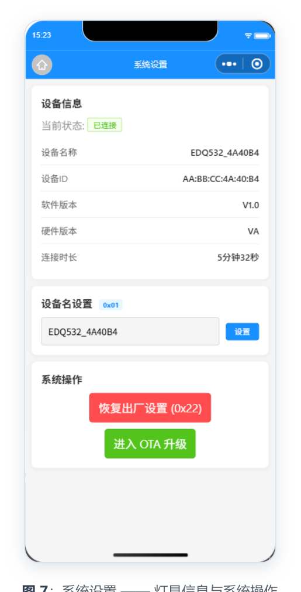
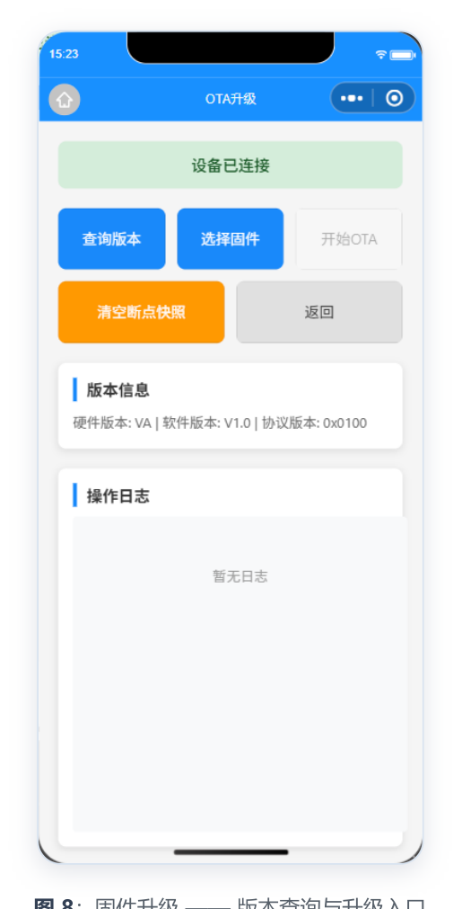
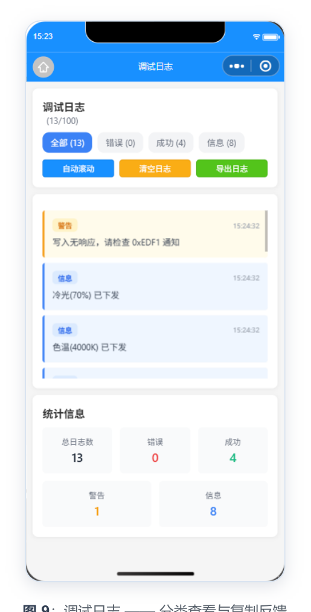

# EDQ532 小程序使用说明

> 「EDQ532 调试工具」微信小程序使用说明在线版，整理自《EDQ532 小程序使用说明书》V1.5（2026-09）

:::info PDF 下载
本页为在线阅读版；完整文档请 [📄 下载 EDQ532 小程序使用说明书（V1.5）](./assets/EDQ532%E5%B0%8F%E7%A8%8B%E5%BA%8F%E4%BD%BF%E7%94%A8%E8%AF%B4%E6%98%8E%E4%B9%A6.pdf)。
:::

## 1 产品简介

### 1.1 EDQ532 是什么

EDQ532 是易探（EasyDetek）的存在感应调光调色照明控制器，主要能力：

- **人来灯亮，人走灯灭**：雷达感应自动检测是否有人，有人自动开灯，人离开后按设定延时自动关灯，也可随时手动控制
- **亮度调节**：0–100% 无级调光，明暗随心
- **色温调节**：2700K 暖黄光 ～ 6500K 正白光连续可调，还可分别设定冷光、暖光两种灯珠的比例
- **感知环境光**：实时显示环境光照强弱，可设置光照条件，避免白天无人值守时误亮灯
- **手机直接控制**：无需联网、无需网关、无需注册账号，手机蓝牙即可连接使用

### 1.2 小程序能做什么

「EDQ532 调试工具」是灯具的手机配套工具，装在微信里，随手可用：

| 功能 | 说明 |
|------|------|
| 连接灯具 | 自动搜索附近的 EDQ532 灯具，点一下即可连接 |
| 控制灯光 | 开关、亮度、色温、冷光/暖光独立调节、无人延时、恢复出厂 |
| 感应设置 | 检测范围、灵敏度、安装高度、检测开关，实时查看有无人与环境光照 |
| 固件升级 | 为灯具更新固件，支持中途断开后从断点继续 |
| 调试日志 | 查看小程序运行记录，遇到问题可一键复制反馈给售后 |

### 1.3 它是怎么工作的

## 2 使用前准备

### 2.1 使用前检查

- 手机蓝牙已开启；首次使用按手机提示允许微信使用蓝牙
- **安卓手机**：需允许微信获取位置（定位）权限——手机系统要求开启此权限才能搜索到蓝牙设备，否则列表会一直为空
- **苹果手机**：首次使用请在系统设置中允许微信使用蓝牙
- 灯具已通电并处于待连接状态（名称形如 `EDQ532_xxxxxx`），且没有被其他手机连接占用

:::tip 小提示
灯具与手机距离越近、中间遮挡越少，搜索和连接越快。隔墙操作可能搜不到或信号弱。
:::

## 3 连接设备

### 3.1 连接步骤

1. **进入「设备扫描」页**：打开小程序，在首页点「设备扫描」
2. **点「开始扫描」**：列表只显示名称以 EDQ532 开头的灯具（如 `EDQ532_4A40B4`），扫描约 10 秒自动结束，可随时手动停止
3. **点目标灯具右侧「连接」**：优先选择信号格数多、信号强度数值更接近 0 的灯具（如 -52 比 -71 信号更好）
4. **等待「已连接」**：连接成功后自动返回进入前的页面（通常为首页），首页顶部显示灯具名称与版本信息
5. **断开连接**：不需要时，在首页点「断开连接」并在确认弹窗中确定即可

:::warning 提示
若长时间停留在「连接中」，请点停止后再重试一次；多次失败时，先把手机蓝牙关掉再打开，然后重新扫描连接。
:::

## 4 各页面使用说明

以下界面为演示数据下的页面示意（灯具 `EDQ532_4A40B4`，已连接状态），以实际界面为准。

### 4.1 首页

**功能点**：

- **设备状态卡**：显示当前连接状态、灯具名称、软件/硬件版本
- **灯控快捷入口**：连接灯具后显示，一键直达灯控页
- **功能菜单**：设备扫描 / 设备控制（快速） / EDQ532 灯控参数 / 雷达参数设置 / 系统设置 / OTA 升级 / 调试日志（其中「设备扫描」「调试日志」始终显示，其余需连接灯具后才会出现）
- **快捷操作**：查询版本、断开连接（连接后显示）

### 4.2 设备扫描

**功能点**：

- **扫描控制**：开始 / 停止扫描，单次约 10 秒自动结束
- **设备列表**：显示灯具名称、编号和信号强度（信号条格数）
- **筛选选项**：「仅显示 EDQ532 前缀设备」（默认开启）、「设备名称过滤」关键字、「仅显示命名设备」（默认开启）、「最低信号强度」滑杆

**操作**：

1. **点「开始扫描」**：等目标灯具出现在列表里（确认灯具已通电、距离不要太远）
2. **选信号好的**：信号格数越多越好；多盏灯同时出现时，按名称区分
3. **点「连接」**：连接成功后会自动返回进入前的页面（通常为首页）

### 4.3 快捷控制

**功能点**：

- **电源开关**：开灯 / 关灯，拨动立即生效
- **亮度**：滑杆 0–100%，拖动后点「下发亮度」按钮生效
- **色温**：滑杆 2700K（暖黄）～6500K（正白），按 100K 步进，拖动后点「下发色温」按钮生效
- 读取当前状态 / 进入完整灯控

进入页面会自动读取灯具当前的开关、亮度、色温状态。开关拨动后立即生效；亮度和色温拖动滑杆后不会立即生效，需再点对应的「下发亮度」「下发色温」按钮才会作用于灯具。需要冷暖光独立调节、无人延时等更多设置时，点「进入完整灯控」。

### 4.4 灯控参数

**功能点**：

- **电源开关**：开灯 / 关灯
- **亮度**：滑杆 + 数字输入，范围 0–100%，点「下发亮度」生效
- **色温**：滑杆 + 数字输入，2700–6500K，点「下发色温」生效
- **冷光通道 / 暖光通道**：两种灯珠 0–100% 独立调节，分别点「下发冷光」「下发暖光」生效，适合按现场喜好微调光色
- **无人延时**：人离开后灯光保持的秒数（数字输入），可设置 1–7200 秒（最长 2 小时），默认 300 秒（5 分钟）；填 0 或非法值自动按默认 300 秒下发，点「下发延时」生效
- 恢复出厂、读取当前参数（一键读回灯具的全部当前设置）

**操作**：

1. **读取当前设置**：进入页面自动读取，也可点「读取当前参数」批量刷新
2. **逐项调节**：电源开关拨动后立即生效；亮度、色温、冷光、暖光、无人延时则需拖滑杆或填数字后，再点对应「下发」按钮（下发亮度 / 下发色温 / 下发冷光 / 下发暖光 / 下发延时）才会生效
3. **确认生效**：下发成功会弹出提示（如「亮度已设置」「色温已设置」），页面随后显示灯具回读后的真实值

:::danger 危险操作
恢复出厂设置会重置灯具的全部参数（亮度、色温、冷暖光、无人延时）并自动重启，弹窗中需再点「恢复出厂」确认才会执行。操作前请确认现场允许灯具恢复默认状态。
:::

### 4.5 雷达参数设置

**功能点**：

- **实时状态**：有人 / 无人 与 环境光照 数值自动刷新（约每 2 秒一次，有人/无人状态变化时也会即时更新）；也可点「立即刷新」手动查看，或用「自动轮询」开关关闭自动刷新
- **感应设置**：检测范围（左/右）、无人延时、光照阈值、移动灵敏度、存在灵敏度、安装高度，每项都可单独「读 / 写」（各项可设置范围见下表）
- **检测开关**：移动检测、存在检测（开 / 关），拨动后需点「下发移动检测」/「下发存在检测」按钮才生效
- 读取全部参数：一键读回所有感应设置

**各项可设置范围**：

| 设置项 | 可设置范围 | 说明 |
|--------|-----------|------|
| 检测范围（左 / 右） | 0–65535 毫米 | 对应区域的感应半径（如填 3000 约为 3 米）；数值越大探测越远，实际效果以雷达性能为限 |
| 无人延时 | 1–7200 秒 | 人离开后灯光保持的时长，默认 300 秒（5 分钟） |
| 光照阈值 | 预留功能 | 当前固件版本暂不支持设置（读写无响应），后续版本开放 |
| 移动灵敏度 | 0–100 | 数值越小越灵敏 |
| 存在灵敏度 | 0–100 | 数值越小越灵敏 |
| 安装高度 | 2.5–4 米 | 按灯具实际安装高度填写，支持一位小数（界面按米填写，自动换算） |

**操作**：

1. **看实时状态**：在灯具下方走动，观察「有人/无人」状态和光照数值自动变化
2. **改设置**：进入页面会自动逐项读取当前参数；修改时在输入框填目标值 → 点该项「写」；点「读」可查看灯具当前值
3. **安装高度按米填**：单位是米，按灯具实际安装高度填写（一般 2.5–4 米，可带一位小数，如 3 或 2.8）

### 4.6 系统设置

**功能点**：

- **灯具信息**：名称、编号、软硬件版本、本次连接时长
- **灯具改名**：设置灯具名称的后缀部分，方便在多盏灯中区分
- **系统操作**：恢复出厂设置（见 4.4 警告，弹窗确认后执行）、进入 OTA 升级

**操作**：输入新的设备名（后缀）→ 点「设置」，成功后会提示「设备名已设置」。新名称何时反映到扫描列表中，以灯具实际表现为准。

### 4.7 固件升级（OTA）

**功能点**：

- **查询版本**：查看灯具当前的软件/硬件版本
- **选择固件**：从手机中选择升级文件，显示文件名、大小与分片数（个别环境不支持选文件时，改为输入固件链接下载）
- **开始 OTA**：点后先弹确认框；升级中实时显示进度、传输速度、已用时间与预计剩余时间
- **清空断点快照**：放弃上次未完成的升级进度，下次从头重新开始

完整升级步骤与注意事项见下文[固件升级指南](#固件升级指南)。

### 4.8 调试日志

**功能点**：

- **分类查看**：全部 / 错误 / 成功 / 信息 四类筛选，下方统计区另列警告条数
- **自动滚动**：开启后自动显示最新记录
- **清空日志 / 导出日志**：清空需二次确认；导出把记录复制到剪贴板，粘贴发给售后即可

页面保留最近 100 条记录：搜索、连接、控制、升级等操作都有留痕，方便反馈问题时快速定位原因。

## 固件升级指南

### 升级步骤

1. **连接灯具**：按第 3 章步骤连接要升级的灯具
2. **查询当前版本**：进入「OTA 升级」页点「查询版本」，记下当前版本号
3. **选择升级文件**：点「选择固件」从手机中选择配套提供的升级文件，核对文件名与大小
4. **点「开始 OTA」**：在确认弹窗中确认后开始，进度条开始走动，期间不要退出小程序、不要锁屏
5. **等待完成**：进度到 100% 后页面弹出「OTA 升级完成」提示，灯具自动重启并应用新固件，期间灯会短暂熄灭，属正常现象
6. **确认升级结果**：重新连接灯具，点「查询版本」确认版本已更新为目标版本

### 注意事项

:::warning 重要
升级过程中请保持小程序在前台、手机屏幕常亮。升级暂时没有进展时小程序会自动重试，多次尝试仍无法继续才会提示失败并停止；若连接断开，小程序会自动尝试重连（最多三次），仍失败会提示「连接断开，请重新连接」。
:::

- 中断不用担心：重新发起升级会从上次中断的位置继续；若灯具上已没有可用进度，则会从头开始
- 如果更换了升级文件，请先点「清空断点快照」再重新开始，避免新旧文件混用
- 升级期间请让手机尽量靠近灯具，避免走到信号覆盖之外

### 升级提示怎么看

| 提示 | 含义 | 怎么做 |
|------|------|--------|
| 版本不匹配 | 升级文件不适用于本灯具 | 向供应商确认并更换正确的升级文件 |
| 设备忙 | 灯具正在处理其他任务 | 稍等片刻重试；仍不行就点「清空断点快照」后重新升级 |
| CRC 校验失败 / 无效大小 | 升级文件不完整、已损坏，或不是本灯具适用的文件 | 重新获取正确的升级文件 |
| 连接断开，请重新连接 | 手机与灯具距离过远或有强干扰 | 靠近灯具后重新发起升级，会自动从断点继续 |

## 常见问题

### Q1：扫描不到任何 EDQ532 灯具？

依次检查：① 手机蓝牙已开启；② 微信已获得定位权限（安卓手机必需）；③ 灯具已通电且没有被其他手机连接；④ 手机离灯具近一些。筛选开关「仅显示 EDQ532 前缀设备」默认开启，可临时关闭确认是不是筛选造成的。

### Q2：连接一直停在「连接中」？

请点停止后再重试一次，多数情况即可连上；多次失败时，把手机蓝牙关掉再打开，然后重新扫描连接。仍失败可杀掉微信后重新打开小程序。

### Q3：调节了亮度/色温，灯没有反应？

先确认首页顶部显示已连接；再确认拖动滑杆后已点「下发亮度」/「下发色温」按钮（只拖滑杆不会生效）；然后确认灯具的墙面开关/供电正常（灯具断电时无法响应）；如手机与灯具隔了墙或距离较远，请靠近后重试。点下发后页面会弹出设置成功提示，以提示为准。

### Q4：升级进度不动 / 中途失败了？

多数是小程序切到了后台或手机锁屏。重新打开小程序、保持前台和屏幕常亮后再次发起升级即可，会自动从上次的位置继续。如果反复卡在同一位置，点「清空断点快照」后重新升级（见升级提示对照表）。

### Q5：恢复出厂设置会怎样？

灯具的全部自定义设置（亮度、色温、延时等）会被清空并自动重启，重启后按默认状态运行、重新等待连接。页面已做二次确认弹窗，误触不会直接生效。

## 产品信息

| 项目 | 内容 |
|------|------|
| 适用产品 | EDQ532 存在感应调光调色照明控制器 |
| 小程序版本 | V1.0（2026-09） |
| 连接方式 | 手机蓝牙直连（无需网络、无需网关） |
| 文档版本 | V1.5（2026-09） |
