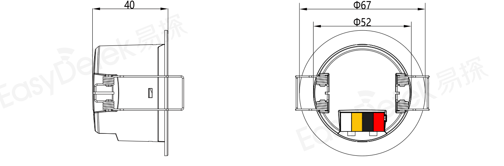
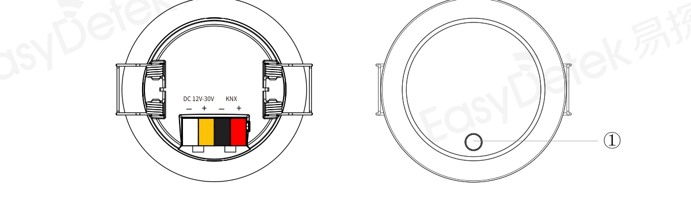
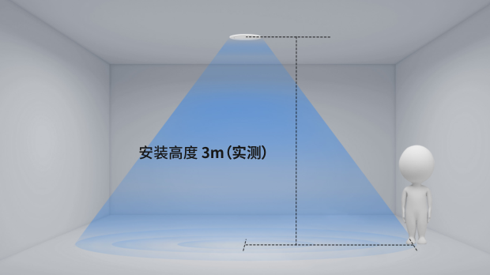
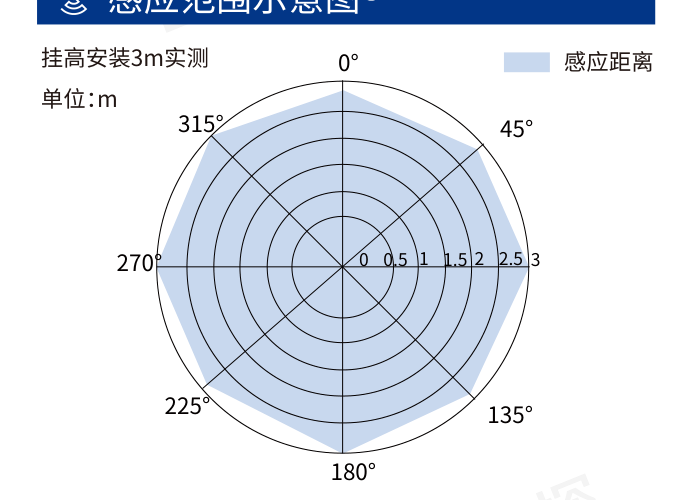
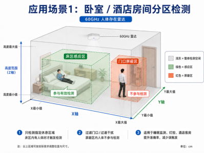
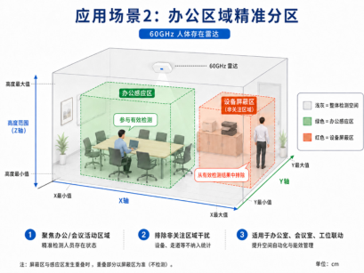
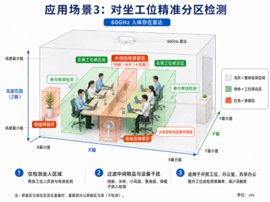
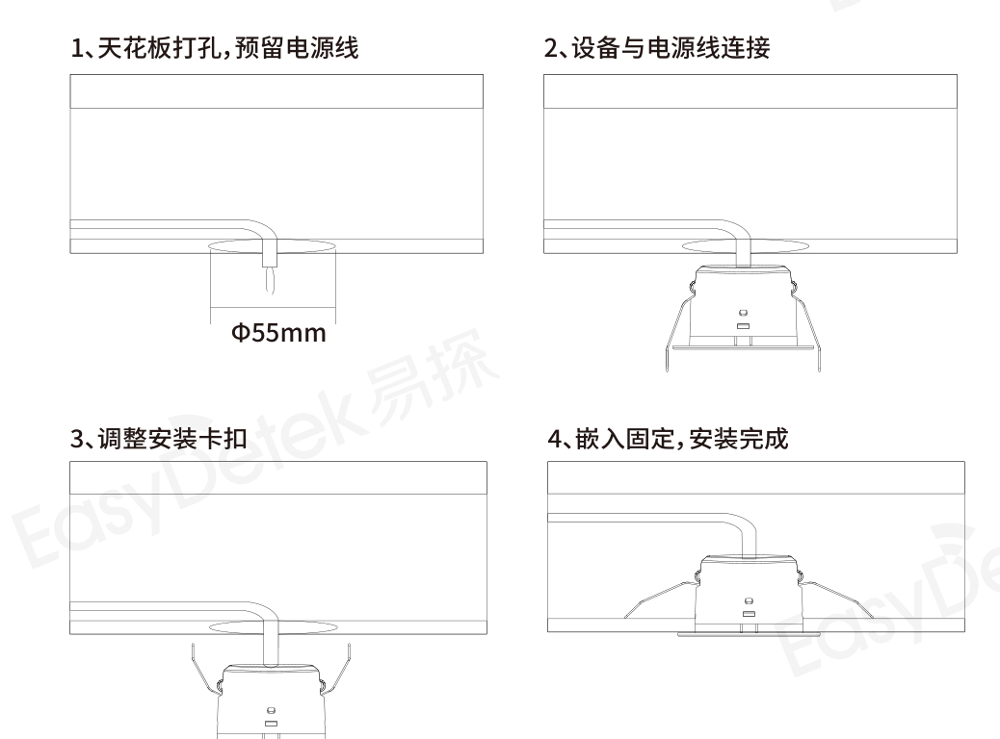

# EDV21C-K 规格书

> EDV21C-K（KNX 版）规格书在线版，整理自《EDV21C-K 规格书》V0.9（2026-07-23）

:::info PDF 下载
- [📄 中文版规格书 EDV21C-K（V0.9）](./assets/EDV21C-K%E8%A7%84%E6%A0%BC%E4%B9%A6-V0.9-20260723.pdf)
- [📄 Specifications (EN) EDV21C-K（V0.9）](./assets/EDV21C-K-Specifications-V0.9-20260723.pdf)
:::

## 产品特征

- 蓝牙小程序调节
- 60GHz 强抗干扰天线
- DC 12~30V 供电
- 嵌入式独立安装，标准开孔 Φ55mm
- 支持 KNX 通讯

## 产品尺寸图

EDV21C-K 尺寸公差：±0.2mm

## 引脚及按键说明

| 引脚 | 说明 |
|------|------|
| KNX+（红） | KNX + |
| KNX-（黑） | KNX - |
| V（黄） | 12~30V DC 辅助供电 + |
| G（白） | 12~30V DC - |
| ① | 编程按键 |

## 指示灯状态说明

| 序号 | 工作状态 | 指示灯说明 |
|------|---------|-----------|
| 1 | 上电 5 秒 | 绿灯亮一次 |
| 2 | 检测到有人 | 绿灯 5 秒闪一次 |
| 3 | MQTT 连接成功 | 红灯闪一次 |
| 4 | 恢复出厂设置 | 长按按键 |

## 电气参数

| 项目 | 数值 |
|------|------|
| 输入电压 | DC 12~30V |
| 工作电流 | ＜800mA |
| 工作频率 | 58-64GHz |
| 3dB 波束角 | 60°（xz 平面）/ 60°（yz 平面） |
| 待机功耗 | 2.64W |

## 功能参数

| 项目 | 数值 |
|------|------|
| 感应半径 ① | 3m Max |
| 挂高高度 | 默认 3m |

## 环境温度

| 项目 | 数值 |
|------|------|
| 工作温度 | -20~+60℃ |
| 储存温度 | -20~+85℃ |

## 探测示意图

:::note 备注 ①
测试距离范围是以传感器挂高 3m、室内安装环境测试，测试人员身高 170cm、体重 65-75kg、行走速度 1m/s，不同的场景安装可能会造成范围变化，以实际测试为准。
:::

## 功能说明：三维区域管理

设备支持三维区域管理功能，用户可通过小程序配置感应区和屏蔽区。每个区域以三维长方体形式定义，区域范围由 X 轴最小值、X 轴最大值、Y 轴最小值、Y 轴最大值、高度最小值、高度最大值共同确定。配置感应区后，设备仅对感应区内目标进行有效检测判断；配置屏蔽区后，设备将屏蔽区内目标从有效检测结果中排除。该功能用于适配不同安装环境下的检测边界需求，提升人员存在判断、人数统计及轨迹输出的准确性。

| 应用场景 1：卧室/酒店房间分区检测 | 应用场景 2：办公区域精准分区 | 应用场景 3：对卫生间精准分区检测 |
|----------------------------------|------------------------------|----------------------------------|
|  |  |  |

## 安装示意图

## 蓝牙小程序功能说明

EDV21C-K 支持通过蓝牙小程序完成设备信息查看、人员轨迹显示、三维分区（感应区/屏蔽区）管理、灵敏度与延时调节、Wi-Fi/MQTT 配置、透传调试及配置保存/导入/同步等全量参数配置。

详细功能说明见 [EDV21C 使用说明：小程序使用指南](../usage-manuals#34-小程序使用指南)。

## 历史修订记录

| 版本 | 时间 | 备注 | 描述 |
|------|------|------|------|
| V0.9 | 2026-07-23 | - | 原型版本 |

## 注意事项

1. 传感器由市电供电，安拆应由专业人员操作，安拆前确保先切断电源
2. 传感器不应安装于有大面积金属覆盖的空间内
3. 多个雷达传感器在同一场地应用时，安装距离过近可能引发个别雷达传感器产生误报，推荐产品安装间距大于 2m
4. 传感器与无线通讯模块（NB、蓝牙、WIFI 模块）等一起使用时，应拉开间距。推荐安装时与路由器、无线热点等大功率无线通讯设备保持 1m 以上间距
5. 传感器光感阈值是在晴天环境、无阴影、环境光漫反射条件下的测试值
6. 传感器安装时应尽可能的远离金属、空调外机、排风扇等有震动的场景以免传感器误判
7. 易探科技致力于为客户提供高品质和更好体验的雷达传感器，产品版本更新和迭代时，恕不另行通知。如需要，请您联系我们销售人员，获取最新的产品资料
