# EDV21C 使用说明

> EDV21C 系列（-W / -4 / -K）使用说明在线版，整理自《EDV21C 系列产品使用说明书》V1.0.11（2026-09-03），适用于全部三个型号

:::info PDF 下载
本页为在线阅读版（中文）；完整中英对照版请 [📄 下载 PDF 使用说明书（V1.0.11）](./assets/EDV21C-%E4%BD%BF%E7%94%A8%E8%AF%B4%E6%98%8E%E4%B9%A6-%E5%A4%96%E9%83%A8%E7%89%88-V1.0.11-260903.pdf)。
:::

## 1 产品介绍

### 1.1 产品概述

EDV21C 系列产品，工作频段为 59-64GHz，主要面向区域人数统计与人员轨迹监测应用，单台设备能够实现 3 米范围内区域局部分区，对区域内人员存在状态、移动轨迹及在场人数进行同步探测。产品融合纯毫米波 FMCW 探测技术，依托雷达捕捉人体微动、行走动作，可同时追踪最多 20 组人员坐标轨迹；并通过 RS485、KNX、Wi-Fi-MQTT 等多通讯渠道实时上报全部检测数据。设备不受光照、温湿度变化干扰，无图像采集，从根源保护用户隐私，搭配三维分区屏蔽功能可过滤家具、墙体等静态干扰，适用于商业安防、酒店商用、办公空间等场景的人员监测。

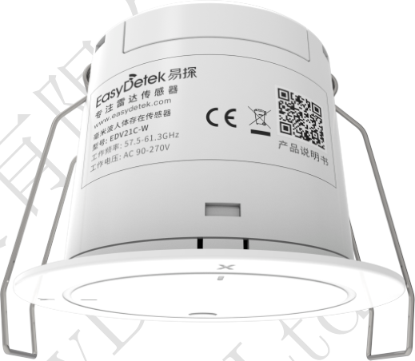

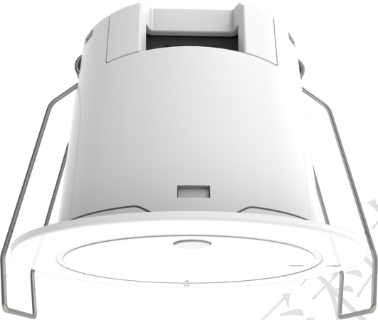

### 1.2 产品特点

- **灵活配置**：多配置方式、丰富配置内容、配置便捷性；搭配蓝牙小程序，可在线完成三维分区、灵敏度、延时、网络通讯等全量参数调试与自定义设置，操作简单直观
- **抗干扰能力强**：搭载 60GHz 高抗干扰天线，运行稳定，有效抵御光照、温湿度、绿植窗帘无热源移动、2.4G 无线设备等各类环境干扰
- **供电方式灵活**：交流、直流多种供电方式可选，均支持宽电压供电（-W 支持 AC 90-270V，-4/-K 支持 DC 12-30V）
- **易安装部署**：采用嵌入式独立安装，标准开孔 Φ55mm，施工便捷
- **通讯拓展丰富**：分型号搭载 Wi-Fi、RS485、KNX 多类通讯协议，可无缝对接楼宇自控、智能家居、物联网云平台等各类智能控制系统

### 1.3 应用场景

- **智慧办公**：开放式工位分区人数统计，人在灯亮、人走灯灭节能管控
- **智慧酒店**：客房人员数量识别、有人无人判定，联动客房用电节能管控
- **智能家居**：全屋房间存在感知、分区人员监测，联动照明、空调自动运行
- **医疗康养**：实时监测老人与康复患者活动轨迹，辅助康复状态监测

### 1.4 外形结构

#### 外形尺寸

全系列通用安装开孔：标准 Φ55mm，产品整体尺寸公差 ±0.2mm。

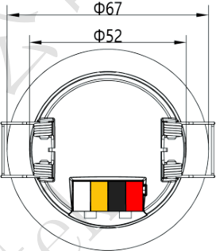

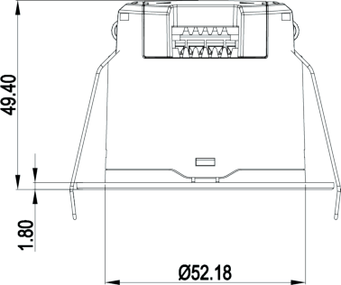

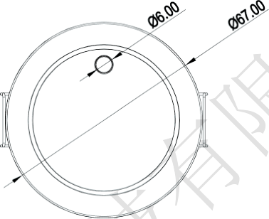

#### 接口说明

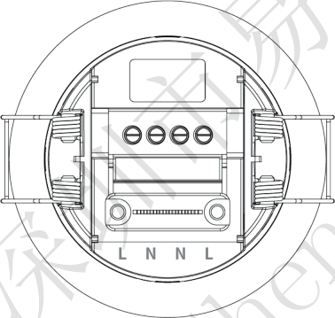

| 接口序号 | 名称 | 功能 |
|---------|------|------|
| 1 | L | 火线端口 |
| 2 | N | 零线端口 |
| 3 | N | 零线端口 |
| 4 | L | 火线端口 |

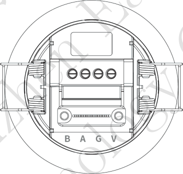

| 接口序号 | 名称 | 功能 |
|---------|------|------|
| 1 | V | DC 12-30V 电源输入正极 |
| 2 | G | 电源负极 / GND |
| 3 | A | RS485-A |
| 4 | B | RS485-B |

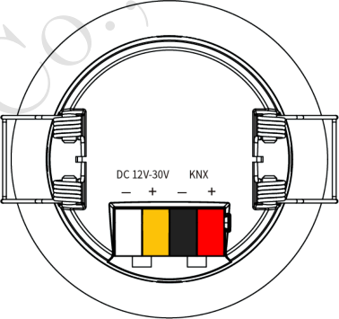

| 接口序号 | 名称 | 功能 |
|---------|------|------|
| 1 | KNX+（红） | KNX + |
| 2 | KNX-（黑） | KNX - |
| 3 | V（黄） | 12-30V DC 辅助供电+ |
| 4 | G（白） | 12-30V DC - |

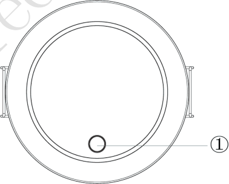

| 接口序号 | 名称 | 功能 |
|---------|------|------|
| ① | Set/Reset（-K：编程按键 Prog. key） | 配网/复位共用按钮（-K 版为 KNX 编程按键） |

### 1.5 性能参数

#### 参数列表

| 类别 | 参数 | 可配置 | 数值 | 单位 | 说明 |
|------|------|--------|------|------|------|
| 雷达参数 | 工作频段 | N | 59-64 | GHz | 毫米波频段 |
| 雷达参数 | 发射功率 | N | ＜15 | dBm | 低功率毫米波发射 |
| 雷达参数 | 调制方式 | N | FMCW | - | 调频连续波体制 |
| 雷达参数 | 3dB 波束角 | N | 60°（xz 平面）/ 60°（yz 平面） | ° | xz/yz 平面波束宽度 |
| 雷达参数 | 距离分辨率 | N | 5 | cm | 距离维目标分辨能力 |
| 性能参数 | 感应范围 | Y | 6×6 Max.（半径 3m） | m | 挂高 3m 实测，范围可配 |
| 性能参数 | 可探测人数 | N | ≤20 | 人 | 同时输出目标轨迹 |
| 性能参数 | 运动灵敏度 | Y | 0-10（默认 9） | 级 | 小程序滑动条设置 |
| 性能参数 | 存在灵敏度 | Y | 0-10（默认 9） | 级 | 小程序滑动条设置 |
| 性能参数 | 雷达延时 | Y | 0-1800（默认 5） | s | 检测保持延时 |
| 性能参数 | 目标消失延时 | Y | 2-7200（默认 5） | s | 与雷达延时叠加生效 |
| 性能参数 | 上报周期 | Y | 100-65500（50 步进，默认 1000） | ms | 数据上报频率 |
| 性能参数 | 检测范围（X/Y） | Y | -350～+350（默认） | cm | 最小/最大值可配 |
| 性能参数 | 检测高度（Z） | Y | 0～350（默认 30-200） | cm | 最小/最大值可配 |
| 电气参数 | 工作电压 | N | W：AC 90-270V；4：DC 12-30V；K：DC 12-30V | V | 分型号供电 |
| 电气参数 | 工作电流 | N | ＜800 | mA | 典型值 |
| 电气参数 | 待机功耗 | N | 2.64 | W | 典型值 |
| 物理参数 | 外形尺寸 | N | Φ67×40 | mm | 开孔 Φ55，公差 ±0.2 |
| 物理参数 | 外壳材质 | N | PC | - | - |
| 物理参数 | 防护等级 | N | IP67 | - | 室内防潮环境 |
| 物理参数 | 安装方式 | N | 嵌入式暗装 | - | 开孔 Φ55，卡扣固定 |
| 物理参数 | 安装高度 | Y | 0～4（默认 3） | m | 按实际挂高设置，推荐 2.5-3m |
| 环境适应性 | 工作温度 | N | -20～+60 | ℃ | - |
| 环境适应性 | 储存温度 | N | -20～+85 | ℃ | - |
| 环境适应性 | 抗干扰类型 | N | 光照、温湿度、2.4G 无线设备等 | - | 不受光照温湿度干扰 |
| 环境适应性 | 抗震动 | N | - | - | 远离震动源安装 |

:::note
「可配置」指是否提供接口供用户根据需要对该参数在允许范围内进行配置。
:::

#### 性能曲线

:::note 测试条件
以下性能曲线在室内空旷环境实测：安装高度 3m；X/Y 检测范围 -300～+300cm，检测高度 50-250cm（默认配置）；测试人员身高 170cm、体重 65-75kg，行走速度 1m/s。不同场景安装可能造成范围变化，以实际测试为准。
:::

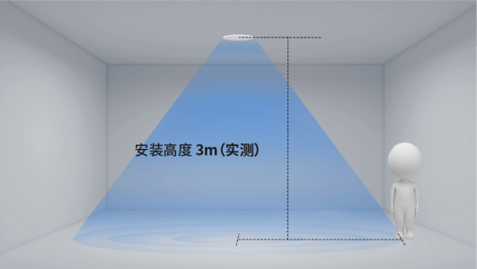

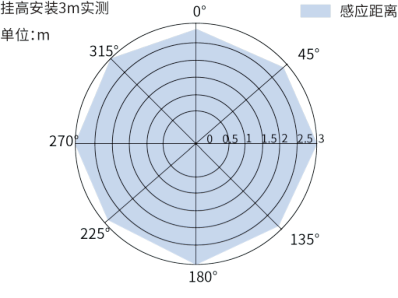

### 1.6 可定制项

| 定制项 | 定制范围 | 单位 | 说明 |
|--------|---------|------|------|
| 安装高度 | 0～400（默认 300） | cm | 与安装环境一致 |
| 检测范围（X/Y） | -350～+350（默认） | cm | 感应区坐标边界可自定义 |
| 检测高度（Z） | 0～350（默认 30-200） | cm | 立体检测高度范围 |
| 运动灵敏度 | 0-10（默认 9） | 级 | 数值越高越灵敏 |
| 存在灵敏度 | 0-10（默认 9） | 级 | 数值越高越灵敏 |
| 雷达延时 | 0-1800（默认 5） | s | 检测保持时间 |
| 目标消失延时 | 2-7200（默认 5） | s | 人离开后保持时间 |
| 上报周期 | 100-65500（50 步进，默认 1000） | ms | 数据上报频率 |
| 感应区/屏蔽区 | 各最多 10 个 | 三维长方体区域 | 适配现场检测边界与干扰屏蔽 |
| 通讯参数 | Wi-Fi、MQTT、透传等 | - | 按项目网络环境配置 |

:::note
如有未标明的其他定制需求，请联系销售经理或 FAE 进行评估。
:::

## 2 命名规范

| 字段 | 取值 | 含义 |
|------|------|------|
| 制造商 | ED | 易探 EasyDetek |
| 频段 | V | 60GHz |
| 大类别 | 2 | 独立传感器 |
| 子类别 | 1 | 旗舰系列 |
| 编号 | C | 产品编号 |
| 扩展功能 | K / W / 4 | K＝KNX、W＝WiFi、4＝RS485 |
| 流水号 | 0~9、A~Z | 流水号 |

**示例**：EDV21C-W = 易探（ED）+ 60GHz 频段（V）+ 独立传感器（2）+ 旗舰系列（1）+ 产品编号（C）+ WiFi 功能（W）；EDV21C-K 中 K 代表 KNX 功能，EDV21C-4 中 4 代表 485 功能。

各字段可选代号含义：

| 字段 | 可选代号 |
|------|---------|
| 频段 | C＝5.8GHz、X＝10.5GHz、Q＝24GHz、V＝60GHz、S＝生态产品 |
| 大类别 | 1＝雷达模组、2＝独立传感器、3＝天线＆器件、4＝MCU、5＝配件、6＝IC、7＝AI 传感、8＝组网、9＝待定义 |
| 子类别 | 0＝超低功耗、1＝旗舰、2＝侧装、3＝外置可调、5＝通用、6＝户外、7＝保留、8＝基础、9＝高空 |
| 扩展功能 | Y＝有光敏、N＝无光敏、A＝Matter、B＝BLE、C＝Casambi、D＝Dali、G＝干接点、K＝KNX、M＝米家、P＝PLC、R＝RF433、S＝AC 开关、T＝涂鸦、W＝WiFi、Z＝Zigbee、1＝Cat-1、2＝2.4G、4＝RS485 |

## 3 使用指南

### 3.1 安装指南

#### 安装前检查

- 确认安装环境符合要求，避免周边有震动源（冰箱、空调外机、水泵等）
- 检查感应范围内无晃动物体、大面积金属物品（吊灯、风扇、金属涂层镜子等）
- 确认供电电源纹波低于 100mV，避免电源干扰
- 如与其他雷达传感器同场使用，确保安装间距大于 2 米

#### 安装步骤

- 安装高度：推荐 2.5-3 米，最大探测范围 4 米
- 嵌入式暗装：开设 Φ55mm 标准安装孔，提前布设供电/通讯线缆

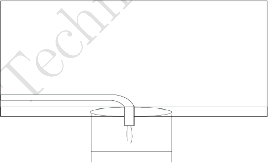

- 接线操作：按照对应型号接口定义，连接电源线、通讯线，确认接线牢固

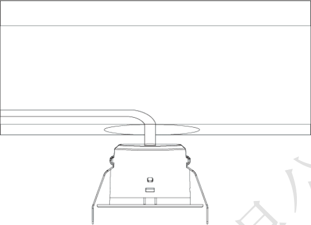

- 卡扣调节：调整设备两侧安装卡扣，适配吊顶厚度

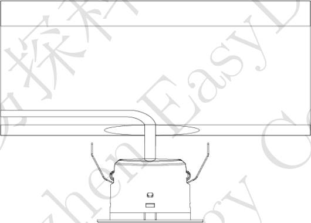

- 固定就位：将设备嵌入开孔，保持设备稳固，避免抖动，锁紧卡扣，完成安装

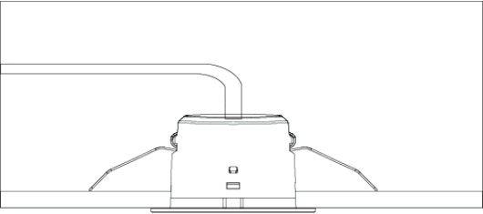

#### 接线说明

**EDV21C-W（Wi-Fi 版）**：火线（L-L）与零线（N-N）两个端子互为连通状态，供电时选单火单零接入即可，如采用手拉手方式布线，可将另外两根线接入另外的 LN 端子，给其他传感器供电，不允许从感应器引线给高功率设备供电。

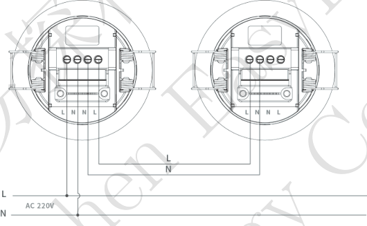

**EDV21C-4（RS485 版）**：V（电源正）/ G（电源负）端子接 DC 12-30V 供电，注意极性；A/B 端子接 RS485 总线，多机 Modbus 组网时按手拉手（菊花链）方式连接总线。

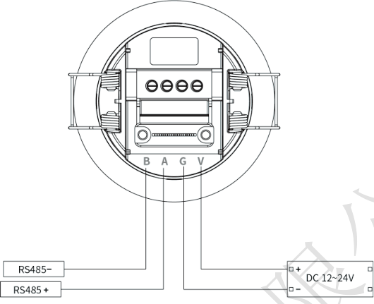

**EDV21C-K（KNX 版）**：KNX+（红）/ KNX-（黑）接 KNX 总线（按线色区分极性）；V（黄）/ G（白）端子接 DC 12-30V 辅助供电；①键为 KNX 编程按键，供 KNX 调试工具使用。

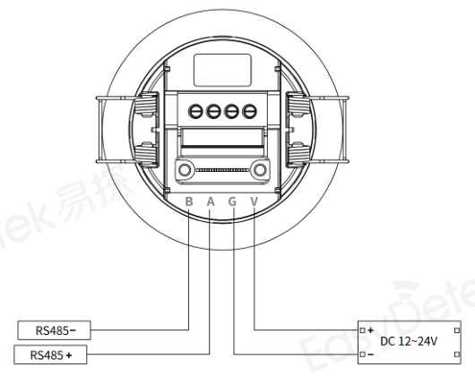

### 3.2 功能时序

全系列统一指示灯与功能时序：

| 序号 | 工作状态 | 指示灯说明 |
|------|---------|-----------|
| 1 | 上电初始化 | 通电后绿色指示灯常亮 5 秒 |
| 2 | 感应触发 | 识别到人体移动/存在，绿色指示灯每 5 秒闪烁 1 次 |
| 3 | MQTT 连接成功 | 红色指示灯闪烁 1 次（带 Wi-Fi 功能版本） |
| 4 | 配网模式/恢复出厂设置 | 长按配网键 5 秒后，1 秒闪 4 次进入配网模式，配网过程中每 3 秒闪烁 1 次 |
| 5 | 延时关闭 | 目标离开后，按设定的目标消失延时结束后恢复待机 |

### 3.3 设置和调试指南

#### 初始化与自学习

设备首次安装、更换安装环境、修改分区参数后，建议断电重启一次，设备自动完成环境自学习，过滤墙体、固定家具等静态干扰，保障人数统计、轨迹定位准确性；新增/修改感应区、屏蔽区后，保存配置等待 10 秒算法生效，再现场测试探测效果。

### 3.4 小程序使用指南

#### 连接准备

- 设备正常上电，开启手机蓝牙与定位，搜索对应设备蓝牙名称完成连接
- 进入 EDV21C 设备控制主界面，查看设备基础信息

#### 主界面功能

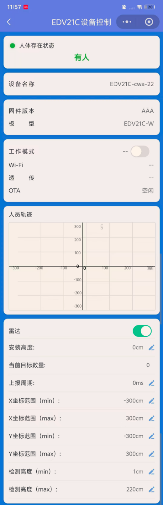

人体存在状态显示：小程序首页显示人体存在状态，能直观区分「有人/无人」，用于快速判断当前检测区域内是否存在人员。

主要功能：

- **设备信息显示**：设备名称、固件版本、板型等基础信息，便于售后与调试确认
- **工作及连接状态显示**：工作模式、Wi-Fi 连接状态、透传状态、OTA 状态等运行信息
- **人员轨迹显示**：以坐标图形式显示目标轨迹及点位、当前目标数量，可查看目标 X/Y 坐标
- **雷达开关控制**：在小程序中开启或关闭雷达检测功能
- **安装高度设置**：按实际安装高度设置（单位 cm，可设 0-400，默认 300）
- **上报周期设置**：坐标、目标数量及状态数据的上报频率（100-65500ms，50 步进，默认 1000ms）
- **检测范围设置**：X/Y 坐标范围最小/最大值（-350～+350）、检测高度最小/最大值（可设 0-350，默认 30-200）
- **感应区/屏蔽区管理**：新增、从设备同步区域，并显示当前区域数量（各最多 10 个）
- **运动灵敏度/存在灵敏度设置**：以滑动条形式设置（0-10 级，默认 9）
- **雷达延时/目标消失延时设置**
- **Wi-Fi 配置**（SSID、密码）；MQTT 配置（主机、端口、周期、开关）
- **透传调试**：透传 Host/端口配置，写入透传并切换模式、切回正常模式
- **配置保存/导入/同步/断开**，便于批量调试与配置复用

#### 注意事项

- Wi-Fi 密码仅写入设备，页面不回显，谨防密码泄露
- 修改通讯、分区等核心参数后，建议同步保存配置，避免断电丢失
- 蓝牙连接距离建议控制在 5 米以内，障碍物过多会导致连接不稳定

## 4 协议规范

### 4.1 通信接口

| 接口类型 | EDV21C-W | EDV21C-4 | EDV21C-K | 功能说明 |
|---------|----------|----------|----------|---------|
| 蓝牙 BLE | √ | √ | √ | 小程序调试、参数配置、OTA 升级 |
| UART 串口 | √ | √ | √ | 本地调试、产测、数据透传 |
| RS485 总线 | × | √ | × | Modbus RTU，工业/楼宇总线组网 |
| KNX 总线 | × | × | √ | KNX 楼宇总线专用接口 |
| Wi-Fi | √ | √ | √ | MQTT 云上报、OTA、远程透传 |

:::note
EDV21C 全系保留 Wi-Fi/MQTT 传输能力（-W 为基础联网方式），-4/-K 型号分别以 RS485/KNX 总线为主要通讯方式。
:::

### 4.2 通讯协议

- **蓝牙协议**：私有蓝牙透传协议，专供小程序配对、参数配置、实时数据查看
- **UART 串口协议**：标准串口通讯，支持本地指令读写、参数查询、产测与原始数据输出
- **RS485 协议**：Modbus RTU 总线协议，支持多设备组网、轮询读写参数与检测数据 → 参见 [Modbus RTU 协议说明](./rs485-modbus/modbus-protocol)
- **KNX 协议**：兼容标准 KNX 楼宇通讯协议，适配主流 KNX 智能家居、楼宇自动化系统
- **MQTT 协议**：基于 Wi-Fi 实现，支持设备状态、人数统计、目标坐标与轨迹数据云端上报，上报周期可自定义 → 参见 [EDV21C MQTT 协议说明](./standard-wifi-mqtt/mqtt)

:::note
详细协议指令、寄存器地址、数据帧格式，请参考配套独立协议文档：《EDV21C MQTT 数据传输协议文档》《EDV2XX Modbus RTU 协议说明》《EDV21C-K KNX 数据传输协议文档》《EDV21C 蓝牙小程序开发接口文档》。
:::

## 5 售后服务

### 5.1 安全合规

- 本产品符合室内智能传感设备安规标准，仅适用于室内环境使用
- 电气接线严格遵循国标电气规范，非专业人员禁止拆机、改线
- 设备防护等级 IP67，仅适用于常规室内防潮环境，禁止长期浸泡、户外淋雨使用

### 5.2 免责声明

- 因用户私自拆机、改装接线、违规供电造成的设备损坏、安全事故，本公司不承担保修及相关责任
- 未按照安装规范（间距、远离干扰源、避开金属区域）安装，导致设备误触发、检测异常，不在免费维保范围内
- 自然灾害、人为磕碰、外力损坏、进水进尘造成的故障，不予免费保修
- 产品固件、规格会持续迭代优化，更新版本不再单独通知，如需最新资料请联系销售人员
- 测试参数为实验室标准环境数据，实际使用效果因现场环境、安装方式存在差异，不属于产品质量问题

### 5.3 售后服务

- **质保服务**：产品按照行业标准提供质保，质保期内非人为质量问题可享受维修、更换服务
- **技术支持**：安装调试、参数配置、协议对接问题，可联系我司销售或 FAE 工程师提供技术支持
- **定制服务**：个性化功能、参数、接口定制，可对接商务团队评估方案与工期
- **资料获取**：最新版说明书、协议文档、固件程序，请联系官方工作人员索取

## 附录 A：系列清单

| 型号 | 供电 | 主要通讯 | 备注 |
|------|------|---------|------|
| EDV21C-W | AC 90-270V | Wi-Fi（MQTT）、蓝牙 BLE | 基础款 |
| EDV21C-4 | DC 12-30V | RS485（Modbus RTU）、蓝牙 BLE | 保留 Wi-Fi/MQTT 能力 |
| EDV21C-K | DC 12-30V | KNX 总线、蓝牙 BLE | KNX 编程按键；保留 Wi-Fi/MQTT 能力 |

:::note
全系统一 59-64GHz 毫米波探测、人数统计与轨迹追踪（≤20 人）、蓝牙小程序调试、嵌入式暗装（安装开孔 Φ55mm）。
:::

## 附录 B：应用案例

### 案例 1：智慧办公

开放式办公区按工位分区部署 EDV21C，实时统计各分区在场人数并识别人员有无，联动照明与空调：有人自动开启、全员离开后按设定延时关闭，实现按需用能管理。三维分区屏蔽功能可排除工位隔断、柜体等静态干扰，保证统计准确。

### 案例 2：智慧酒店

客房顶部嵌入安装 EDV21C，识别入住有人/无人状态与室内人数，联动客房用电节能管控与精准服务提醒。设备无摄像头、无图像采集，从根源保护住客隐私，满足酒店行业对隐私合规的严格要求。
