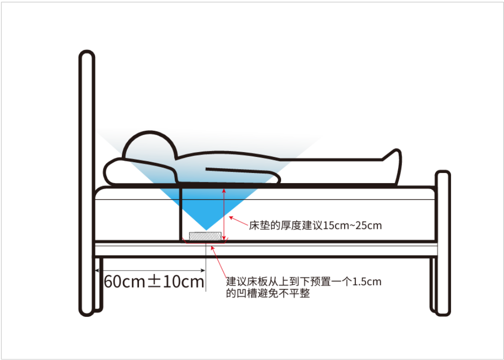
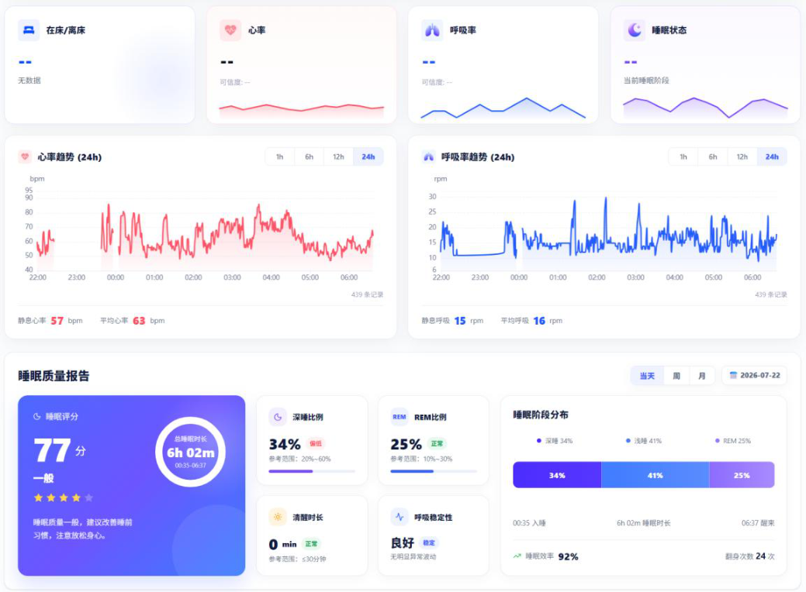
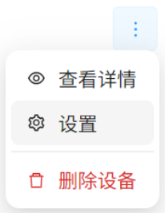
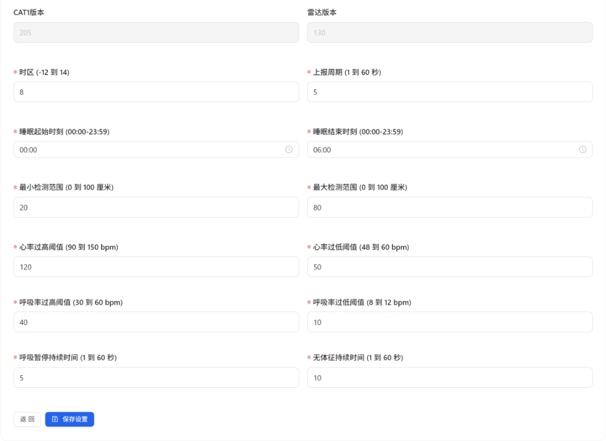

# EDV28A 床垫版使用说明

> EDV28A 床垫版使用说明在线版，整理自《EDV28A（床垫版）使用说明》（2026-07-22）

:::info PDF 下载
[📄 下载 EDV28A 床垫版使用说明（PDF）](./assets/EDV28A-%E5%BA%8A%E5%9E%AB%E7%89%88%E4%BD%BF%E7%94%A8%E8%AF%B4%E6%98%8E-20260722.pdf)
:::

## 安装位置

传感器应放置在床垫下方、床板上方，人体平躺时，胸腔应位于传感器正上方。建议床垫厚度在 15~25cm 的范围。

## 供电

使用 5V2A USB Type-A 接口的适配器进行供电。

## 指示灯含义

| 指示灯状态 | 说明 |
|-----------|------|
| 绿色常亮 | 正在进行上电初始化 |
| 绿色单次闪烁 | 上报体征检测数据 |
| 红色单次闪烁 | 发送设备在线通讯心跳 |
| 绿色连续快速闪烁 | 正在进行 OTA 升级 |
| 红色短亮 | OTA 升级失败 |
| 红色闪烁 | 联网失败 |
| 红色常亮 | SIM 卡异常或设备硬件异常 |

## 网页端查看体征检测数据

进入网页 [https://easydetekiot.com/login](https://easydetekiot.com/login)，输入用户名和密码登录。

登录后点击对应的传感器设备的设备卡片，即可查看实时心率、实时呼吸率、实时在离床/睡眠状态、历史心率呼吸率走势曲线、睡眠质量报告。

## 网页端设置配置参数

点击设备卡片上的三个点符号再点击设置，或者在设备详情页点击齿轮图标，可以进入设备设置界面。

设置界面可以查看设备当前的软件版本信息、设置睡眠和体征检测预警的相关配置参数。

为了提高睡眠质量报告的准确性，需要设置时区、日常睡眠的一般起始时间和一般结束时间。每天的睡眠质量报告生成于设定睡眠结束时间与实际睡眠结束时间两者中最晚的时间。

检测的距离范围建议保持默认值，如果需要修改请咨询技术支持人员。

确认修改配置参数后请点击保存设置按钮。
