# EDV28A 标准版使用说明

> EDV28A-N-01 系列产品使用说明在线版，整理自《EDV28A-N-01 产品使用说明书》V1.0.3（2026-08-10）

:::info PDF 下载
本页为在线阅读版（中文）；完整中英对照版请 [📄 下载 PDF 使用说明书（V1.0.3）](./assets/EDV28A-N-01%E4%BA%A7%E5%93%81%E4%BD%BF%E7%94%A8%E8%AF%B4%E6%98%8E%E4%B9%A6-V1.0.3-20260810.pdf)。
:::

## 1 产品介绍

### 1.1 产品概述

EDV28A-N-01 是一款基于 60GHz 毫米波雷达技术的在位体征监测传感器，可实时探测胸腔毫米级微动，提供舒适无感非接触式长期稳定监测。产品结合边缘计算和智能算法，连续监测分析目标在位情况，及心率、呼吸、体动等关键指标。

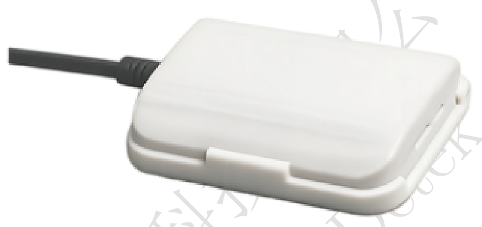

### 1.2 产品特点

- **非接触监测**：采用前沿 60G 毫米波传感技术，实时探测胸腔毫米级微动，提供舒适无感非接触式长期稳定监测
- **智能分析**：结合边缘计算和智能算法，连续监测分析目标在位情况，及心率、呼吸、体动等关键指标
- **睡眠监测**：智能监测睡眠阶段的浅睡、深睡、REM 睡眠、清醒期等情况，可评估和复盘睡眠质量
- **异常警报**：智能识别异常呼吸或心率，支持及时警报，守护用户健康安全
- **隐私安全**：无摄像隐私风险，在物理层和数据层完全严格遵守隐私法规，保护用户信息安全

### 1.3 应用场景

- **商务办公**：安装在办公室区域，实现人员在位监测，智能管理办公环境能耗与安全
- **居家养老**：安装在卧室或客厅，实时监测老人心率、呼吸和体动，异常情况及时警报
- **商业场所**：安装在酒店客房或公寓，实现入住检测与智能客房管理
- **学校宿舍**：安装在宿舍区域，监测学生作息情况，保障住宿安全
- **月子中心**：安装在母婴房间，监测产妇与婴儿体征，守护母婴健康
- **康养机构**：安装在养老院或康复中心，24 小时连续监测长者体征，提升照护效率

### 1.4 外形结构

#### 外形尺寸

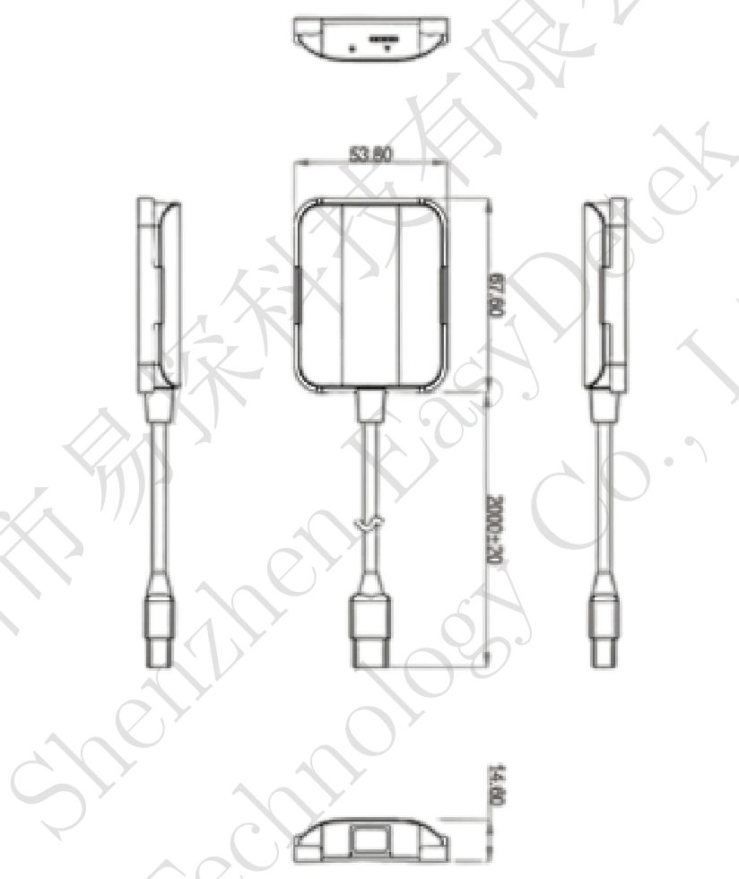

| 参数名称 | 数值 | 单位 |
|---------|------|------|
| 主体长度 | 67.60 | mm |
| 主体宽度 | 53.80 | mm |
| 主体厚度 | 14.60 | mm |
| 连接线总长 | 2000±20 | mm |

#### 接口说明

| 接口序号 | 名称 | 功能 |
|---------|------|------|
| 1 | VCC | 5V 供电电源，使用 5V2A USB Type-A 接口的适配器进行供电 |

### 1.5 性能参数

| 类别 | 参数 | 可配置 | 数值 | 说明 |
|------|------|--------|------|------|
| 发射参数 | 工作频段 | N | 59~64 GHz | 毫米波雷达频段 |
| 发射参数 | 最大发射功率 | N | ≤15 dBm | 雷达最大发射功率 |
| 性能参数 | 探测距离 | Y | ＜1.5 m（默认 0.7 m） | 可配置探测范围 |
| 性能参数 | 在位检测时间 | N | ＜5 s | 目标出现在区域内到检测到的时间 |
| 性能参数 | 离位检测时间 | N | 5~100 s | 目标离开到检测为离位的时间 |
| 性能参数 | 呼吸率范围 | N | 12~40 bpm | 呼吸率测量范围 |
| 性能参数 | 心率范围 | N | 60~120 bpm | 心率测量范围 |
| 性能参数 | 数据上报周期 | Y | 1~60 s（默认 3 s） | 数据上报间隔，可配置 |
| 电气参数 | 工作电压 | N | 5 V | 直流供电电压 |
| 电气参数 | 平均功耗 | N | ＜0.4 W | 正常工作平均功耗 |
| 电气参数 | 最大功耗 | N | ＜1 W | 峰值功耗 |
| 电气参数 | 通讯方式 | N | MQTT | 设备和客户端通信协议 |
| 运行参数 | 工作温度 | N | -20~60°C | 正常工作环境温度范围 |
| 运行参数 | 存储温度 | N | -20~85°C | 存储环境温度范围 |

:::note
「可配置」指是否提供接口供用户根据需要对该参数在允许范围内进行配置。
:::

## 2 命名规范

EDV28A-N-01 型号命名拆解：

| 字段 | 取值 | 含义 |
|------|------|------|
| 制造商 | ED | 易探 EasyDetek |
| 频段 | V | 60GHz |
| 产品大类别 | 2 | 独立传感器 |
| 产品细分类别 | 8 | 基础系列 |
| 产品编号 | A | 产品编号 |
| 功能扩展 | N | 无光敏 |
| 流水号 | 01 | 流水号 |

各字段可选代号含义：

| 字段 | 可选代号 |
|------|---------|
| 频段 | C＝5.8GHz、X＝10.5GHz、Q＝24GHz、V＝60GHz、S＝生态产品 |
| 产品大类别 | 1＝雷达模组、2＝独立传感器、3＝天线＆器件、4＝MCU、5＝配件、6＝IC、7＝AI 传感、8＝组网、9＝待定义 |
| 产品细分类别 | 0＝超低功耗、1＝旗舰、2＝侧装、3＝外置可调、5＝通用、6＝户外、7＝保留、8＝基础、9＝高空 |
| 功能扩展 | Y＝有光敏、N＝无光敏、A＝Matter、B＝BLE、C＝Casambi、D＝Dali、G＝干接点、K＝KNX、M＝米家、P＝PLC、R＝RF433、S＝AC 开关、T＝涂鸦、W＝WiFi、Z＝Zigbee、1＝Cat-1、2＝2.4G、4＝RS485 |
| 流水号 | 0~9、A~Z |

## 3 使用指南

### 3.1 安装指南

#### 安装位置说明

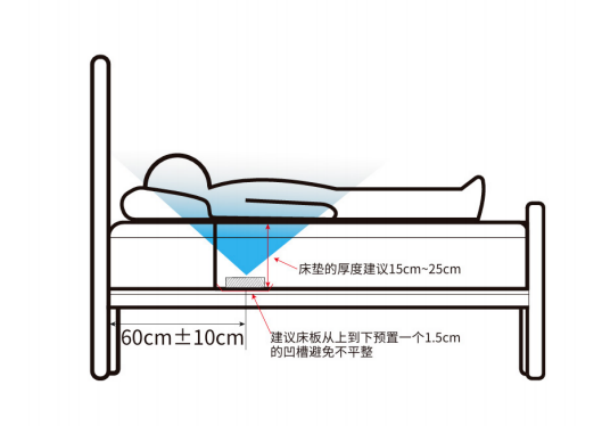

传感器应放置在床垫下方、床板上方，人体平躺时，胸腔应位于传感器正上方。建议床垫厚度在 15~25cm 的范围。

#### 供电与电源要求

- 使用 5V2A USB Type-A 接口的适配器进行供电
- 过大的电源纹波可能对雷达传感器造成干扰产生误报，建议供电电源纹波应低于 100mV

#### 安装注意事项

- 雷达安装位置应避免受周边震动源影响，包括不限于：冰箱、空调外机、水泵、发电机等
- 雷达感应范围内避免有处于晃动、运动、明显振动的物体及大面积金属，包括不限于：吊灯、风扇、空调、绿植、窗帘及有金属涂层的镜子等
- 雷达传感器安装时，背面如有铝基板或其他金属板，应抬高一定高度，与金属平面保持 5mm 以上距离，不能紧贴或接触金属平面；雷达传感器天线面前方不能有金属遮挡以及大电流电缆覆盖，避免正对驱动电源，同时尽量远离驱动电源的整流桥、变压器、开关管等大功率器件
- 雷达传感器对塑胶、木质材料穿透性效果较好，对金属或有金属涂层的材质则不能穿透，如用户产品的外壳为玻璃、陶瓷、碳纤维等特殊材料时，请以实测效果为准，必要时请联系易探科技技术人员做适用性调试
- 为了达到较好的存在检测效果，提升使用体验，建议：探测覆盖空间内避免存在可动物体，包括不限于飘动的窗帘，晃动的绿植、转动的风扇等
- 如雷达传感器与无线通讯模块（NB、蓝牙、WIFI、2.4G 模块）等一起使用时，应拉开间距。推荐安装时与路由器、无线热点等大功率无线通讯设备保持 1m 以上间距

### 3.2 产品功能

实时上报以下状态，并支持统计分析：

- **睡眠统计分析值**：包含入睡时间、起床时间、睡眠时长、睡眠质量分数、浅睡/深睡/REM 占比、翻身次数
- **体征实时状态值**：包含在离位/睡眠状态、体动数值、心率、呼吸率、心率状态、呼吸率状态

设备配备红绿双色指示灯，指示当前工作状态：

| 指示灯状态 | 说明 |
|-----------|------|
| 绿色常亮 | 正在进行上电初始化 |
| 绿色单次闪烁 | 上报体征检测数据 |
| 红色单次闪烁 | 发送设备在线通讯心跳 |
| 绿色连续快速闪烁 | 正在进行 OTA 升级 |
| 红色短亮 | OTA 升级失败 |
| 红色闪烁 | 联网失败 |
| 红色常亮 | SIM 卡异常或设备硬件异常 |

### 3.3 客户端使用指南

#### 登录客户端查看数据

网页端查看体征检测数据：进入网页 [https://easydetekiot.com/login](https://easydetekiot.com/login)，输入用户名和密码登录。

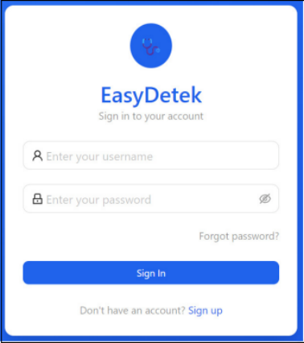

小程序端：进入小程序右下角的【个人中心】，点击【登录】。若还没有账号，可点击登录页下方的【立即注册】进入注册页面。注册页面支持两种注册方式：通过微信授权手机号码一键注册，或输入手机号码获取验证码注册。填完表单后，点击页面下方的【注册】按钮即可完成注册。

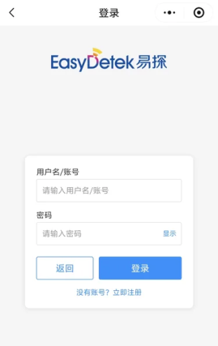

#### 查看与绑定设备

**查看我的设备**：登录成功后可以看到账号的用户信息，点击导航栏【我的设备】即可看到该账号下绑定的所有设备。

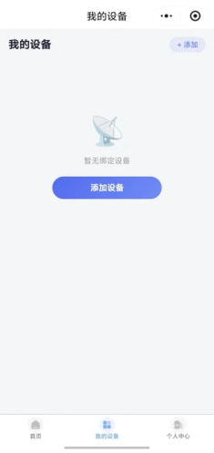

**绑定我的设备**：在【我的设备】页面中，可以点击右上角的添加按钮，添加（绑定）新的设备。点击任意设备卡片即可进入对应的设备详情页，在设备详情页面中可以查看实时监测数据、历史数据、睡眠质量报告等内容。以上为小程序端的查看流程，网页端登录后可直接查看该账号下绑定的所有设备。

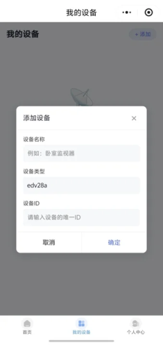

#### 设备详情页

设备详情页面中，可以通过点击图表右上角的【1h / 6h / 12h / 24h】按钮，分别查看各个时间段的数据；睡眠质量报告则可以通过点击右上角的【当天/ 本周/ 本月】按钮，查看不同时间段的汇总报告。

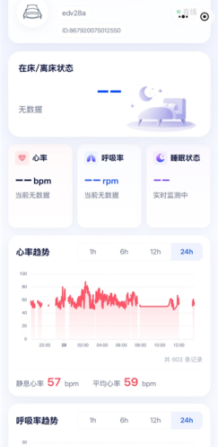

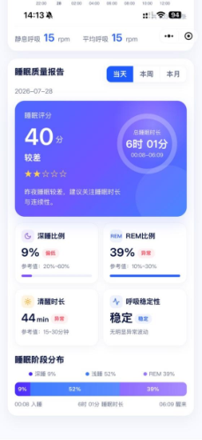

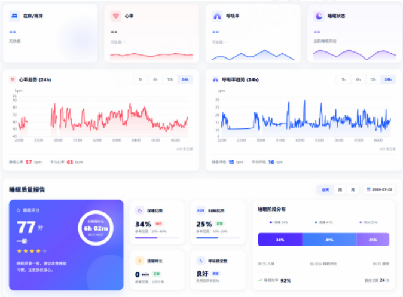

#### 网页端设置配置参数

点击设备卡片上的三个点符号再点击设置，或者在设备详情页点击齿轮图标，可以进入设备设置界面。

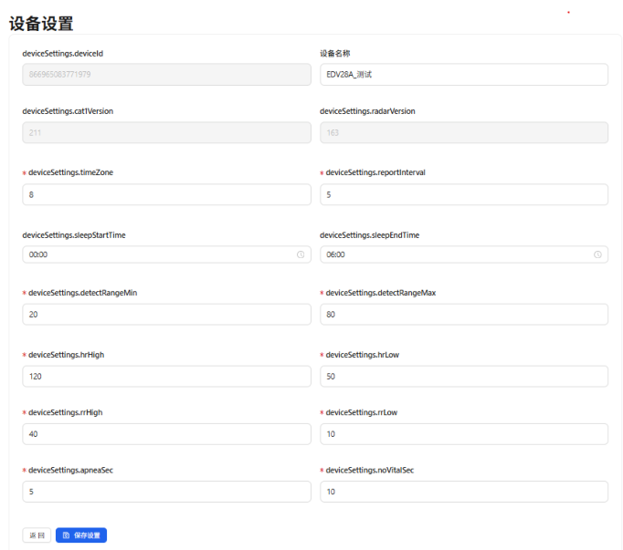

设置界面可以查看设备当前的软件版本信息、设置睡眠和体征检测预警的相关配置参数。

为了提高睡眠质量报告的准确性，需要设置时区、日常睡眠的一般起始时间和一般结束时间。每天的睡眠质量报告生成于设定睡眠结束时间与实际睡眠结束时间两者中最晚的时间。

检测的距离范围建议保持默认值，如果需要修改请咨询技术支持人员。

确认修改配置参数后请点击保存设置按钮。

#### 体征实时状态与统计分析值

**体征实时状态值**：

- **在位/离位状态**：当人进入检测区域后，即会显示在位，人离位一段时间后，会显示离位
- **清醒/睡眠状态**：传感器检测到人睡眠后，分别会进入眼动、浅睡、深睡状态，并进行相应切换
- **呼吸和心率值**：当人进入检测区域后，不会立即显示呼吸和心率值，需等待被测对象处于静息状态后，才能显示呼吸和心率值

**体征和睡眠统计分析值**：

- 从人体静息后，最快 10s 可以输出体征值；人体未处于静息状态，传感器可能会一直无法输出有效的体征值，直到用户处于静息状态

## 4 协议规范

### 4.1 通信接口

本产品采用 USB 接口（Type-C）进行供电和数据通信。通过 USB 连接线接入 5V 直流电源适配器为设备供电。

### 4.2 通讯协议

本产品由雷达监测设备、云端服务平台与客户端（App/网页）构成，通信分为设备接入与应用接口两个层级。

#### 设备接入协议（MQTT）

设备通过 MQTT 协议与云端建立长连接，完成数据上报、远程配置与固件升级（OTA）。

| 项目 | 说明 |
|------|------|
| 传输协议 | MQTT 3.1.1 / 5.0 |
| 服务器 | www.easydetekiot.com |
| 端口 | 1883（TCP） |
| 鉴权 | 用户名/密码 |
| 保活周期 | 60s |
| 通信模型 | 发布/订阅（Topic） |

Topic 规划与样例：

**数据上报**：`radar/{device_type}/{device_id}/data`

```json
// Topic: radar/edv28a/866965083771979/data  QoS: 0
{
  "time_stamp": 1786333856,
  "breath_state": 0,
  "breath_confidence": 2,
  "distance": 29,
  "breath_rate": 15,
  "sleep_state": 1,
  "heart_confidence": 1,
  "heart_rate": 52,
  "heart_state": 0,
  "movement": 10
}
```

**配置下发**：`radar/{device_type}/{device_id}/config/set`

```json
// Topic: radar/edv28a/866965083771979/config/set  QoS: 0
{
  "apnea_sec": 5,
  "detect_range_max": 80,
  "detect_range_min": 20,
  "device_id": "866965083771979",
  "device_name": "EDV28A_测试",
  "hr_high": 120,
  "hr_low": 50,
  "interest_sleep_end_time": 360,
  "interest_sleep_start_time": 0,
  "no_vital_sec": 10,
  "report_interval": 5,
  "rr_high": 40,
  "rr_low": 10,
  "time_zone": 8
}
```

**配置确认**：`radar/{device_type}/{device_id}/config/ack`

```json
// Topic: radar/edv28a/866965083771979/config/ack  QoS: 0
{
  "result": "success",
  "msg": "Config updated"
}
```

**固件请求（OTA）**：`radar/{device_type}/{device_id}/getOta`

```json
// Topic: radar/edv28a/866965083771979/getOta  QoS: 0
{
  "deviceType": "EDV28A",
  "moduleType": "Air780EHV"
}
```

**固件响应（OTA）**：`radar/{device_type}/{device_id}/otaRes`

```json
// Topic: radar/edv28a/866965083771979/otaRes  QoS: 0
{
  "filename": "EDV28A-Air780EHV-v2.0.7-ota-0xF3620EF1.bin",
  "ossUrl": "http://120.24.115.60:8080/firmware-files/EDV28A/Air780EHV/EDV28A-Air780EHV-v2.0.7-ota-0xF3620EF1.bin",
  "status": "succse"
}
```

:::info 完整协议
设备接入 MQTT 协议的完整字段定义与时序说明，见 [EDV28A MQTT 对接协议](./mqtt)。
:::

#### 应用接口协议（REST/HTTPS）

客户端基于 HTTPS 的 RESTful API 与云端交互，提供用户管理、设备绑定、数据查询与配置管理。

| 项目 | 说明 |
|------|------|
| 协议 | HTTPS（REST） |
| Base URL | http://www.easydetekiot.com:3000/api |
| 数据格式 | application/json |
| 鉴权 | Bearer Token（登录后下发） |
| 响应结构 | 统一 ApiResponse：code / msg / data / timestamp |

#### 安全机制

- **传输加密**：设备—云端、客户端—云端通信均经加密通道传输
- **身份认证**：设备采用账号密码鉴权；客户端采用 Bearer Token 鉴权，密码经 RSA 加密后传输
- **数据隔离**：设备与用户账号绑定，数据按账号隔离

## 5 保障条款

### 5.1 安全合规

1. **射频安装规范**：本设备搭载毫米波雷达模组，请勿私自拆解设备壳体；安装时传感器背部避免紧贴大面积金属板材，雷达探测前方不宜存在固定金属遮挡，防止影响探测效果
2. **线缆使用规范**：请勿大力拉扯、反复弯折设备自带连接线，避免线缆内部受损
3. **环境使用要求**：设备通电运行、长期存放需满足产品规定温度范围，避免长期放置在潮湿、具有腐蚀性的环境中
4. **安装布置规范**：安装点位远离水泵、风扇、大功率变频设备、无线路由器等电磁干扰源；探测视野内避免存在持续晃动障碍物
5. **使用禁令**：禁止私自改装设备硬件；禁止人为持续遮挡雷达探测区域；禁止将设备用于法律法规不允许的信息采集场景
6. **报废处置**：设备报废请勿随意丢弃，请按照当地电子废弃物回收相关规定处理

### 5.2 免责声明

1. **违规使用免责**：若未遵循安全合规要求安装、使用设备，由此造成设备损坏、探测功能异常，设备将丧失质保权益，本公司不承担相应损失
2. **检测局限性免责**：心率、呼吸、人体在离位、睡眠状态依靠胸腔微动识别，受床垫条件、被褥厚度、多人同床、外部震动干扰影响，监测数据出现合理误差属于正常情况
3. **数据用途免责**：设备输出各类体征、睡眠统计数据仅可作为日常康养参考，不可作为专业医疗诊断依据，不能单独依靠设备监测结果判断身体健康状况
4. **网络云端免责**：小程序、公众号平台的数据展示依赖移动通信网络与云端服务，因网络故障、服务器维护造成的数据延迟、数据丢失，本公司不予承担责任
5. **外部不可抗力免责**：雷击、电网异常浪涌、周边强电磁干扰、自然灾害等外部因素导致设备故障，不在保修责任范围
6. **人为损坏免责**：进水、外力撞击挤压、私自拆机改造、非官方维修造成的设备损坏，不在保修范围内
7. **版本迭代说明**：产品软硬件持续迭代优化，本说明书内容仅供参考，功能调整更新不再另行通知

### 5.3 售后服务

| 微信公众号 | 微信小店 |
|-----------|---------|
|  |  |
